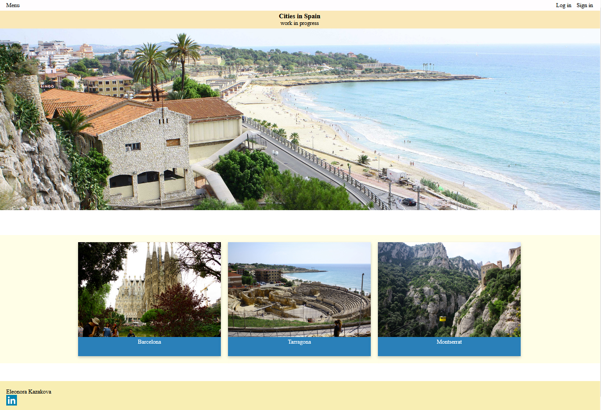

# spain-on-react
https://eleonorakazakova.github.io/spain-on-react/

It is my pet project where I used TypeScript, React, React hooks and SCSS. Also I have set up a build process with NPM, Webpack, Babel and various preprocessors.  I use this project for practice and experiments.

